# 🚀 Render.com Deployment Guide - Green Toolkit Backend

## 📋 Pre-Deployment Checklist

Before deploying to Render.com, ensure:

- [ ] Your code is committed to GitHub
- [ ] `render.yaml` is in your repository root
- [ ] `requirements.txt` contains all necessary dependencies
- [ ] Your FastAPI app runs locally without errors
- [ ] Health check endpoint `/api/health` returns 200

## 🔧 Render.com Configuration

### 1. Service Configuration

**Service Type:** Web Service  
**Environment:** Python 3.11.7  
**Region:** Oregon (US-West)  
**Plan:** Free Tier (512 MB RAM, 0.1 CPU)

### 2. Build Settings

```yaml
buildCommand: |
  pip install --upgrade pip
  pip install -r requirements.txt
```

**Build Time:** ~3-5 minutes (with cache)  
**Memory Usage:** ~200-300 MB during build

### 3. Start Command

```yaml
startCommand: python run_server.py
```

**Startup Time:** ~10-30 seconds  
**Memory Usage:** ~100-200 MB in production

## 🌍 Environment Variables

Set these in Render Dashboard → Environment:

| Variable | Value | Description |
|----------|--------|-------------|
| `PYTHON_VERSION` | `3.11.7` | Python version (auto-set) |
| `PORT` | (auto) | Service port (auto-generated) |
| `ENV` | `production` | Environment identifier |

## 📊 Performance Optimization

### Free Tier Limitations
- **RAM:** 512 MB total
- **CPU:** 0.1 CPU units
- **Sleep:** Services sleep after 15 minutes of inactivity
- **Build Time:** 90 seconds max

### Our Optimizations
1. **Single Worker:** Prevents memory exhaustion
2. **Limited Concurrency:** 20 concurrent requests max
3. **Optimized Dependencies:** Reduced from 27 to 9 packages
4. **Disabled Access Logs:** Saves ~50 MB RAM
5. **Short Keep-Alive:** 5 seconds in production

## 🚀 Deployment Methods

### Method 1: Automatic (Recommended)
```bash
# 1. Make changes locally
git add .
git commit -m "feat: update simulation interface"
git push origin main

# 2. Render auto-deploys in ~5 minutes
# 3. Monitor at https://dashboard.render.com
```

### Method 2: Manual Deploy
1. Go to [Render Dashboard](https://dashboard.render.com)
2. Select your service: `green-toolkit-backend`
3. Click **"Manual Deploy" → "Deploy latest commit"**

### Method 3: Clear Cache Deploy
Use when dependencies change:
1. **"Manual Deploy" → "Clear build cache & deploy"**
2. Takes ~8-10 minutes (rebuilds everything)

## 📈 Monitoring & Debugging

### Health Check
- **URL:** `https://your-app.onrender.com/api/health`
- **Expected Response:** `{"ok": true}`
- **Status Code:** 200

### Build Logs
```bash
# Sample successful build log:
==> Downloading and installing python 3.11.7...
==> Using Python version 3.11.7 (default)
==> Installing dependencies with pip...
Successfully installed fastapi-0.104.1 uvicorn-0.24.0 ...
==> Build successful! 🎉
```

### Runtime Logs
```bash
# Sample startup log:
2024-10-04 12:00:00 - __main__ - INFO - 🚀 Starting Green Toolkit Backend
2024-10-04 12:00:00 - __main__ - INFO - 📋 Environment: production
2024-10-04 12:00:00 - __main__ - INFO - 🌐 Port: 10000
2024-10-04 12:00:01 - uvicorn.error - INFO - Application startup complete.
```

## 🐛 Common Issues & Solutions

### Issue 1: Build Timeout (90s limit exceeded)
**Symptoms:** Build fails with timeout error  
**Solution:** 
- Reduce dependencies in `requirements.txt`
- Use `pip install --no-cache-dir` in build command

### Issue 2: Memory Exhaustion
**Symptoms:** Service crashes with exit code 137  
**Solution:**
- Keep single worker: `workers=1`
- Disable access logs: `access_log=False`
- Reduce concurrency: `limit_concurrency=20`

### Issue 3: Service Sleeps (Free Tier)
**Symptoms:** First request after inactivity takes 10-30 seconds  
**Solution:** This is normal for free tier. Consider:
- Upgrade to paid plan ($7/month)
- Use external service to ping your app every 14 minutes

### Issue 4: Port Binding Error
**Symptoms:** `Address already in use` error  
**Solution:** Ensure you're using `PORT` environment variable:
```python
port = int(os.environ.get("PORT", 8000))
```

## 📊 Expected Performance

### Build Times
- **First Build:** 8-10 minutes (no cache)
- **Subsequent Builds:** 3-5 minutes (with cache)
- **Cache Clear:** 8-10 minutes (full rebuild)

### Runtime Performance
- **Cold Start:** 10-30 seconds (after sleep)
- **Warm Requests:** 50-200ms average
- **Memory Usage:** 100-200 MB steady state
- **Concurrent Users:** 10-20 (free tier limit)

## 🔄 Deployment Workflow

```mermaid
graph LR
    A[Local Development] --> B[Git Commit]
    B --> C[Push to GitHub]
    C --> D[Render Auto-Deploy]
    D --> E{Build Success?}
    E -->|Yes| F[Deploy & Start]
    E -->|No| G[Check Logs]
    G --> H[Fix Issues]
    H --> B
    F --> I[Health Check]
    I --> J[Live! 🎉]
```



## 🎯 Success Indicators

✅ **Build Success:**
- No red error messages in build logs
- "Build successful!" message appears
- All dependencies installed

✅ **Deploy Success:**
- Green circle in Render dashboard
- Health check returns 200
- Application accessible via URL

✅ **Runtime Success:**
- Server responds to requests
- No memory errors in logs
- APIs return expected responses

## 🔗 Quick Links

- **Render Dashboard:** https://dashboard.render.com
- **Your Service URL:** (Check in Render dashboard)
- **GitHub Repository:** https://github.com/sufyanaslam44/green-toolkit-backend
- **Build Logs:** Dashboard → Your Service → Logs → Build
- **Runtime Logs:** Dashboard → Your Service → Logs → Service

## 💡 Pro Tips

1. **Test Locally First:** Always run `python run_server.py` locally before deploying
2. **Monitor Memory:** Use minimal dependencies to stay under 512MB limit
3. **Use Caching:** Don't clear build cache unless necessary
4. **Version Control:** Use specific dependency versions for consistency
5. **Health Checks:** Monitor `/api/health` endpoint for service status

---

**Last Updated:** October 4, 2025  
**Render Plan:** Free Tier (512 MB RAM)  
**Python Version:** 3.11.7  
**Framework:** FastAPI + Uvicorn